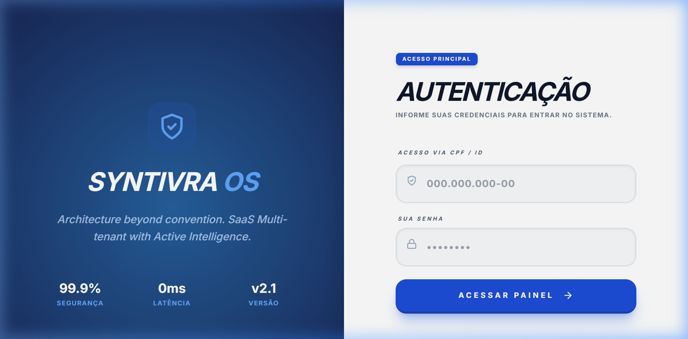
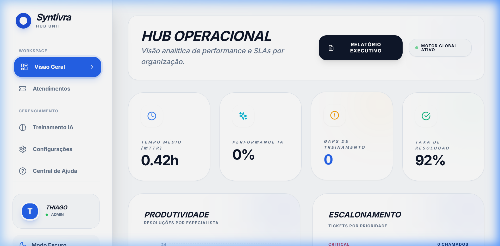
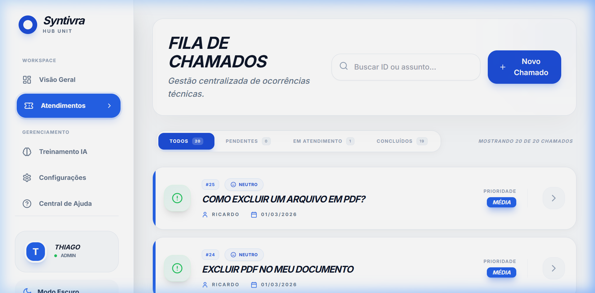
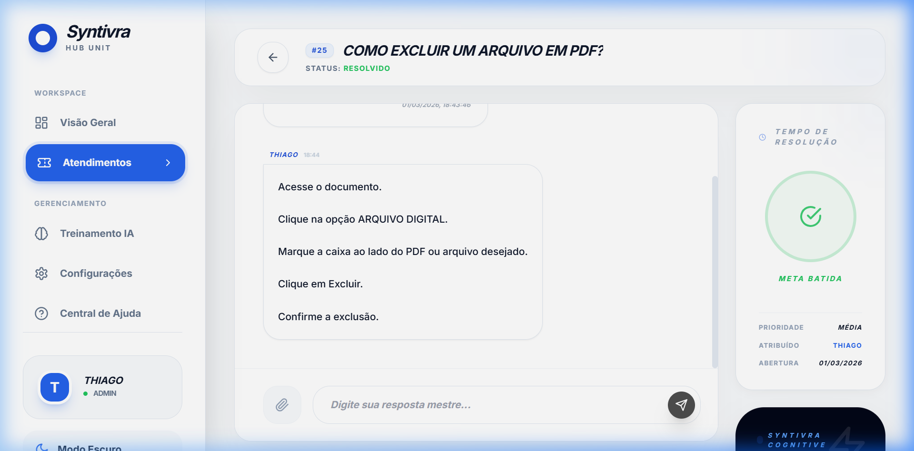

# Syntivra: Enterprise SaaS Multi-Tenant Helpdesk (AI-Powered)

 
*A modern, scalable, and intelligent helpdesk platform for multi-company operations.*

---

## 🚀 Visão Geral
**Syntivra** é um SaaS (Software as a Service) de suporte técnico projetado para alta escalabilidade e isolamento total de dados entre clientes (Multi-tenancy). O sistema utiliza inteligência artificial para analisar tickets históricos e sugerir resoluções em tempo real, otimizando o tempo médio de resposta (MTTR) das equipes técnicas.

## 📸 Demonstração Visual

<table>
  <tr>
    <td></td>
    <td></td>
  </tr>
  <tr>
    <td></td>
    <td></td>
  </tr>
</table>

## 🛠️ Stack Tecnológica (Senior Level)
- **Backend:** Python 3.12 / Django / Django REST Framework (DRF)
- **Database:** PostgreSQL (Ideal para produção) / SQLite (Dev)
- **Isolamento de Dados:** Custom Middleware + ContextVar Tenant Filtering
- **Inteligência Artificial:** PostgreSQL Full-Text Search (MVP) preparado para Vector Embeddings (pgvector)
- **Frontend:** React 18 / Vite / Tailwind CSS (Design Premium/Glassmorphism)
- **Data Viz:** Recharts para Dashboards de Performance
- **State Management:** Zustand (Store-based JWT Auth)
- **Infraestrutura:** Docker & Docker Compose (Containerized Ecosystem)

---

## 🏗️ Arquitetura & Decisões de Design

### 1. Multi-tenancy Nativo (Isolamento por Linha)
O sistema implementa uma estratégia de **Shared Database, Shared Schema**, isolando os dados através de um `organization_id` em cada tabela.
- **Isolamento Transparente:** Desenvolvemos um `TenantModel` e um `TenantManager` customizado que injeta automaticamente filtros de organização em todas as queries. O desenvolvedor não precisa se preocupar em esquecer o `filter(organization=...)`.
- **Segurança via Middleware:** Um middleware extrai o ID da organização do JWT e o injeta em uma `ContextVar` segura por thread/request.

### 2. Service Layer & Desacoplamento
Diferente de projetos básicos que colocam lógica nos models ou views, o Syntivra utiliza a **Service Layer Pattern**:
- **TicketService:** Gerencia a lógica de atribuição inteligente (Least-Assigned Strategy).
- **AIService:** Encapsula a lógica de busca semântica e sugestões.
- **Signals (Event-Driven):** Utilizamos Django Signals para disparar logs de auditoria e análises de IA de forma assíncrona, mantendo as Views limpas e rápidas.

### 3. RBAC (Role-Based Access Control)
Hierarquia de permissões robusta:
- **ADMIN:** Gestão total da organização e usuários.
- **TECHNICIAN:** Acesso à fila de atendimento, chat técnico e métricas de produtividade.
- **END_USER:** Abertura e acompanhamento de seus próprios chamados.

---

## 📊 Dashboard & Métricas Enterprise
O sistema foca em **Data-Driven Support**:
- **MTTR (Mean Time To Resolution):** Cálculo dinâmico direto no banco para medir eficiência.
- **Technician Productivity:** Gráficos de área mostrando volumetria de resoluções por especialista.
- **IA Conversation Analytics:** Insights sobre quanto a IA está contribuindo para as respostas.

---

## 🚦 Como Rodar o Projeto

### Modo Docker (Recomendado)
```bash
docker-compose up --build
```

### Configuração Manual (Backend)
1. `cd backend`
2. `python -m venv venv`
3. `.\venv\Scripts\activate` ou `source venv/bin/activate`
4. `pip install -r requirements.txt`
5. `python manage.py migrate`
6. `python manage.py runserver`

### Configuração Manual (Frontend)
1. `cd frontend`
2. `npm install`
3. `npm run dev`

---

## 🔑 Credenciais de Acesso (Teste)

Para testar as funcionalidades do sistema, utilize as seguintes contas padrão:

### 💎 Admin da Organização (Empresa Demo)
- **Email:** `admin@demo.com`
- **Senha:** `admin123`
- **Acesso:** Dashboard completo, gestão de usuários, configurações de IA e todos os tickets.

### 👤 Cliente / Usuário Final
- **Email:** `cliente@demo.com`
- **Senha:** `cliente123`
- **Acesso:** Portal do cliente, abertura de tickets e acompanhamento.

---

## 🔮 Roadmap de Evolução
- [ ] **Evolução de IA:** Substituição do Full-Text Search por **Vector Embeddings** utilizando `pgvector` e OpenAI/Mistral.
- [ ] **Billing Engine:** Integração com Stripe para faturamento por assento (per-seat) ou volumetria de tickets.
- [ ] **Realtime:** Migração do polling de chat para **WebSockets** (Django Channels).
- [ ] **Observabilidade:** Implementação de Prometheus e Grafana para monitoramento de saúde do sistema.

---

**Desenvolvido como projeto de portfólio de alto nível para Engenharia de Software.**
